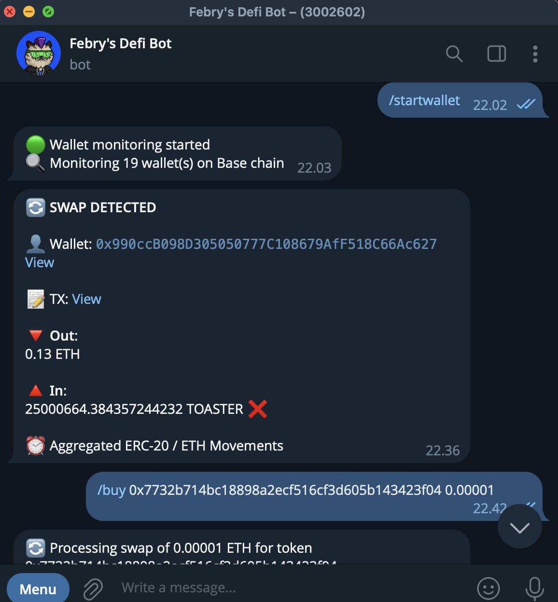

# Base Sniper Bot 🎯

<p align="center">
	
</p>

Minimal, focused monitoring & trading assistant for the Base chain. Written in TypeScript. Sends real‑time Telegram alerts for:

- New Uniswap V2 pairs (and first-liquidity Uniswap V3 pools) with configurable ETH liquidity window
- Manual buy / sell swaps executed via Relay API (single‑chain Base swaps)
- Wallet activity (incoming / outgoing ETH + aggregated ERC20 swap summary + basic ERC721; ERC1155 placeholders)
- Token blacklist filtering (symbol based)

Only active features are documented below (unsupported / future ideas removed for clarity).

## Features (Implemented) ✅

 - Uniswap V2 PairCreated listener (Base)
 - Uniswap V3 PoolCreated + first Mint liquidity alert (first Mint after creation)
 - Liquidity filter: MIN_LIQUIDITY_ETH < liquidity < MAX_LIQUIDITY_ETH
 - Contract verification check (Etherscan) for non‑WETH token sides
 - Token blacklist (add/remove/reset via commands)
 - Relay-based buy & sell (/buy, /sell) with slippage control & optional max sell
 - Wallet monitoring: add/remove/start/stop, aggregated swap summary per tx
 - Telegram command interface (single authorized chat)
 - Structured, timestamped alerts with DexScreener & BaseScan links
 - Dynamic factory selection (add/remove factories at runtime without restart)

Not implemented (and therefore omitted): Aerodrome monitoring, universal router, automatic sniping, big buy tracking, multi-chain.

## Requirements 📋

- Node 18+
- Alchemy Base WebSocket + HTTP endpoints
- Telegram bot token & target chat ID
- (Optional) Wallet private key for /buy & /sell
- Etherscan API key (verification checks)

## Quick Start ⚡

1. Clone & install
```bash
git clone <repo-url>
cd base-sniper-bot
npm install
```
2. Create `.env` (see .env.example)
3. Run development mode
```bash
npm run dev
```
4. Use Telegram `/start` (token monitoring) or `/startwallet` (wallet monitoring)

Only variables actually read in `config.ts` need values; placeholders are fine for unused ones.

## Run Scripts 🛠️
```bash
npm run dev      # nodemon + ts-node
npm run dev:ts   # ts-node once
npm run build    # tsc compile to dist
npm start        # production (needs build)
```

## Telegram Commands

Monitoring:
 - /start /stop /status – token monitoring (only currently selected factories; /start shows count)
 - /factorylist – list available factory keys
 - /factoryselected – show selected factories persisted in state
 - /addfactory <factory_name> – add factory (e.g. uniswapV2, uniswapV3)
 - /removefactory <factory_name> – remove factory
 - /listen <wallet> /unlisten <wallet> /unlistenall – manage monitored wallets
 - /wallets /walletstatus /startwallet /stopwallet – wallet monitoring control

Trading:
- /buy <token> <eth> [router_index] [slippage%] – buy via Relay (router_index kept for legacy: 0/1)
- /sell <token> <amount|max> [router_index] [slippage%]
- /tokenbalance <token>

Utility:
 - /blacklist – list symbols
 - /addblacklist <symbol>
 - /removeblacklist <symbol>
 - /resetblacklist
 - /myinfo – basic wallet info
 - /tokenbalance <token_address>
 - /help – list commands

All restricted to the configured `TELEGRAM_CHAT_ID`.

## Blacklist 🚫
Symbol list is persisted in the environment‑specific state file (see State Persistence). Commands modify it at runtime. Helpers in `blacklistUtils.ts` (exact match + substring helpers). Reset with `/resetblacklist`.

## State Persistence 🗂️
Runtime data (token blacklist, monitored wallet addresses, etc.) is stored in a JSON file selected by `NODE_ENV`:

| Environment | File Used    |
|-------------|--------------|
| production  | `state.json` |
| anything else (dev/test) | `state-dev.json` |

Notes:
- The file must already exist; the service loads it with `readFileSync` and will throw if missing.
- Keep both files if you alternate between dev and production locally; otherwise only create the one you need.
- Minimal starter content:
	```json
	{
		"tokenBlacklist": [],
		"walletAddresses": [],
		"factorySelected": ["uniswapV2", "uniswapV3"]
	}
	```
- To unify environments you can: (a) always run with `NODE_ENV=production` and just keep `state.json`, or (b) adjust `StateService` to auto-create a default if the file is missing.
- `factorySelected` controls which factory listeners (/start) attaches. Changing via commands hot‑reloads listeners without process restart.

Security tip: Never put secrets in these state files; they are for non‑sensitive runtime data only.

## Disclaimer ⚠️
Educational use only. No warranty. You assume all risk.

MIT License.